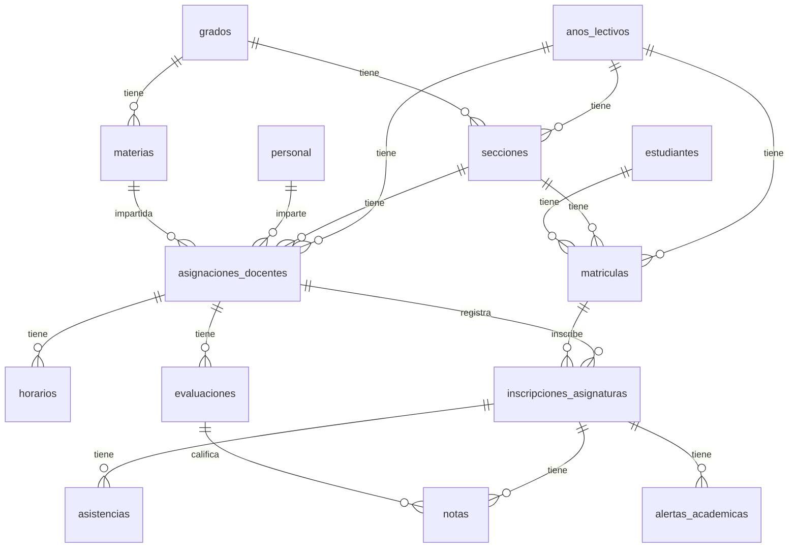

# Sistema de Gestion Escolar - Base de Datos

Este repositorio contiene el diseño, arquitectura e implementacion de la base de datos relacional para un sistema de gestion escolar. El proyecto incluye la definicion del esquema fisico en PostgreSQL, vistas analiticas, triggers de automatizacion y scripts para poblar el sistema con datos de prueba realistas y coherentes para el ciclo lectivo 2026.

## Indice de Contenido
1. [Informacion General](#informacion-general)
   - [Descripcion del Proyecto](#descripcion-del-proyecto)
   - [Problema que Resuelve](#problema-que-resuelve)
2. [Diseño y Arquitectura](#diseño-y-arquitectura)
   - [Diagrama de Entidad Relacion](#diagrama-de-entidad-relacion)
   - [Entidades y Relaciones](#entidades-y-relaciones)
   - [Reglas de Negocio](#reglas-de-negocio)
   - [Automatizaciones mediante Triggers](#automatizaciones-mediante-triggers)
3. [Guia de Datos de Prueba](#guia-de-datos-de-prueba)
   - [Resumen de Semillas](#resumen-de-semillas)
   - [Perfiles Academicos para Validacion de Alertas](#perfiles-academicos-para-validacion-de-alertas)
4. [Instalacion y Configuracion](#instalacion-y-configuracion)
   - [Metodo 1: Despliegue con Docker (Recomendado)](#metodo-1-despliegue-con-docker-recomendado)
   - [Metodo 2: Instalacion Local en PostgreSQL](#metodo-2-instalacion-local-en-postgresql)
     - [Instalacion en Windows](#instalacion-en-windows)
     - [Instalacion en Linux](#instalacion-en-linux)
5. [Estructura del Proyecto](#estructura-del-proyecto)

---

## Informacion General

### Descripción del Proyecto
El proyecto consiste en una base de datos escolar robusta desarrollada en PostgreSQL 15, diseñada bajo los principios de normalizacion de bases de datos. Permite la administracion completa de ciclos lectivos, matrícula de alumnos, programación de materias, asignación de horarios, gestión de calificaciones trimestrales y control de asistencias por clase.

### Problema que Resuelve
La gestión de datos en instituciones educativas suele presentar retos de integridad y consistencia, como el solapamiento de horarios de profesores, la asignación de aulas ocupadas o la inscripción de alumnos en asignaturas que no corresponden a sus secciones. Este sistema resuelve dicha problematica trasladando la logica de consistencia a nivel de base de datos mediante restricciones fisicas y triggers transaccionales, impidiendo la generacion de datos contradictorios y calculando automaticamente promedios academicos y alertas de rendimiento en tiempo real.

---

## Diseño y Arquitectura

### Diagrama de Entidad Relacion

A continuación se presenta la arquitectura lógica de la base de datos modelada en formato de diagrama de entidad relacion:



### Entidades y Relaciones

El esquema cuenta con 17 tablas estructuradas de la siguiente manera:

- **anos_lectivos**: Registra el año cronologico, límites de fecha del periodo escolar y estado de actividad.
- **grados**: Define la jerarquía escolar (Parvularia, Basica, Media) y su orden administrativo.
- **secciones**: División de grados por letra, turno (Mañana, Tarde, Completo) y año lectivo.
- **estudiantes**: Almacena los datos demograficos, NIE (Número de Identificación Estudiantíl) único, edad y variables socio-familiares.
- **matriculas**: Controla el estado del alumno en una sección durante un año lectivo (Activa, Retirada, Trasladada).
- **personal**: Catálogo del cuerpo docente, incluyendo especialidades y correos institucionales únicos.
- **materias**: Asignaturas específicas vinculadas a un grado escolar.
- **asignaciones_docentes**: Entidad asociativa que vincula al docente con la materia y la sección escolar.
- **horarios**: Programa de clases detallando dia de la semana (1-7), hora inicio/fin y aula asignada.
- **inscripciones_asignaturas**: Registro detallado de materias cursadas por el estudiante matriculado, donde se calculan los promedios del Trimestre 1, Trimestre 2, Trimestre 3 y el promedio final.
- **evaluaciones**: Actividades academicas específicas creadas por el docente por trimestre, cada una con un peso porcentual.
- **notas**: Calificaciones obtenidas por el alumno por evaluación.
- **asistencias**: Control diario de asistencia por asignatura (Presente, Ausente, Justificada, Tardanza).
- **alertas_academicas**: Alertas generadas dinamicamente basadas en el promedio academico bajo (< 6.00) o inasistencia excesiva (> 25%).
- **auditoria_notas**: Bitacora que almacena el historial de modificaciones, eliminaciones e inserciones de calificaciones para control de auditoría.
- **respaldo_inscripciones**: Historial de respaldo lógico de inscripciones eliminadas.

### Reglas de Negocio

El sistema garantiza que no se violen las siguientes reglas:

- **Especialidad Docente**: Un docente solo puede impartir una única materia dentro de un mismo año lectivo.
- **Peso de Evaluaciones**: La suma de los pesos porcentuales de las evaluaciones creadas por un docente para una asignatura y trimestre especifico no puede superar el 100.00%.
- **Inscripciones Coherentes**: Un alumno solo puede ser inscrito en asignaturas de la sección y año exactos a los que pertenece su matrícula activa.
- **Asistencia Coherente**: Solo se puede registrar asistencia en la fecha correspondiente al dia de la semana que la materia tiene clases programadas en el horario semanal.
- **Inscripcion Activa**: No se permite agregar notas o asistencias a estudiantes con inscripciones en estado "retirada" o "bloqueada".

### Automatizaciones mediante Triggers

La base de datos cuenta con triggers específicos implementados en PL/pgSQL:

- **trg_validar_peso_evaluaciones**: Valida la suma de pesos de evaluaciones previo a su inserción.
- **trg_actualizar_promedio**: Calcula de forma automática y ponderada el promedio ponderado de los trimestres cursados. Dispara automaticamente alertas de tipo `promedio_bajo` cuando el promedio calculado cae por debajo de 6.00.
- **trg_validar_horario**: Evita solapamientos físicos evaluando choques de horario de docentes, alumnos en la sección o utilización de aulas mediante operadores de sobreposición temporal `OVERLAPS`.
- **trg_validar_asistencia_fecha**: Compara el dia de la semana de la fecha de asistencia contra el horario programado para evitar registros erroneos.
- **trg_actualizar_alertas_asistencia**: Calcula la proporción de ausencias del estudiante. Si supera el 25.00% de las clases programadas, genera una alerta automatica. Si el alumno asiste posteriormente y el porcentaje disminuye por debajo del 25.00%, la alerta se marca como resuelta de forma automatica.
- **trg_auditoria_notas**: Genera el registro automatico en la bitacora de auditoria al ingresar, actualizar o eliminar calificaciones.

---

## Guia de Datos de Prueba

El sistema incluye semillas diseñadas para simular el ciclo escolar 2026. Para obtener informacion detallada de los datos sembrados, puede consultar la [Guia de Datos de Prueba](guia_datos_pruebas.md).

### Resumen de Semillas
- **Poblacion academica**: Primer Grado, Quinto Grado y Noveno Grado en secciones A y B de cada nivel.
- **Estudiantes matriculados**: 48 estudiantes activos (8 por seccion).
- **Asignaciones**: Cada seccion cuenta con 5 materias activas asignadas a docentes especialistas.
- **Horarios**: 30 clases semanales planificadas de Lunes a Viernes en turnos correspondientes.
- **Historicos**: 4 semanas completas de asistencia registradas en febrero de 2026 y notas correspondientes a los Trimestres 1 y 2.

### Perfiles Academicos para Validacion de Alertas
Los datos fueron estructurados en base al modulo de la matricula del estudiante (`id_matricula % 8`) para simular casos reales de prueba:

- **Alerta de Rendimiento Critico** (`id_matricula % 8 = 5`): Alumnos con promedio menor a 6.00 en T1 y T2. Generan alertas activas de tipo `promedio_bajo` de forma automatica (ej. Estudiante Aaron Morales, id_matricula: 5).
- **Recuperacion Academica** (`id_matricula % 8 = 6`): Promedio bajo en T1 (genera alerta activa) y aprobacion sobresaliente en T2 (ej. Estudiante Andres Benitez, id_matricula: 6).
- **Inasistencia Excesiva** (`id_matricula % 8 = 3`): Alumnos con dos inasistencias en la materia de Matematica durante febrero (50% de ausencias). Disparan automaticamente la alerta `inasistencia_excesiva` (ej. Estudiante Amelia Arias, id_matricula: 3).
- **Excelente Desempeño** (`id_matricula % 8 = 0`): Calificaciones perfectas de 9.50 y 10.00 en todas las evaluaciones (ej. Estudiante David Crespo, id_matricula: 8).

---

## Instalacion y Configuracion

### Metodo 1: Despliegue con Docker (Recomendado)

Docker crea de forma aislada e instantanea todo el entorno de base de datos e inicializa el esquema y los datos sin necesidad de configuraciones previas en el sistema operativo.

#### Requisitos Previos:
- Tener instalado Docker Desktop o Docker Engine.

#### Pasos para la Instalacion:

1. Abra una terminal en el directorio raiz del proyecto.
2. Inicie el contenedor ejecutando el siguiente comando:
   ```bash
   docker-compose up -d
   ```
3. Docker descargara la imagen oficial de PostgreSQL 15, creara el contenedor y ejecutara los archivos SQL en orden. La base de datos `sistema_escolar` estara creada y poblada automaticamente.
4. Para conectarse a la base de datos a traves del contenedor, puede utilizar programas como DBeaver, pgAdmin o la terminal de comandos de docker:
   ```bash
   docker exec -it postgres_sistema_escolar psql -U postgres -d sistema_escolar
   ```
5. Para apagar y eliminar los contenedores y red creados:
   ```bash
   docker-compose down
   ```

---

### Metodo 2: Instalacion Local en PostgreSQL

Si ya posee una instalacion local de PostgreSQL en su computadora, puede ejecutar los scripts directamente utilizando la herramienta interactiva de comandos `psql`.

#### Requisitos Previos:
- Servidor PostgreSQL instalado y en ejecucion (Version 12 o superior recomendada).
- El comando `psql` configurado en las variables de entorno del sistema operativo.

#### Instalacion en Windows

1. Abra la consola de **PowerShell** o **Símbolo del Sistema** (cmd.exe).
2. Dirijase a la carpeta del proyecto:
   ```cmd
   cd C:\Ruta\De\Tu\Proyecto
   ```
3. Ejecute la instalacion general conectandose al usuario administrador de PostgreSQL (`postgres`):
   ```cmd
   psql -U postgres -f run_all.sql
   ```
4. Ingrese la contraseña de su usuario local `postgres` cuando el sistema lo solicite. El script ejecutara las sentencias correspondientes recreando la base de datos `sistema_escolar` y conectandose a ella para cargar el esquema y las semillas.

#### Instalacion en Linux

1. Abra su terminal.
2. Navegue al directorio donde se extrajo el proyecto:
   ```bash
   cd /ruta/de/tu/proyecto
   ```
3. Ejecute el script `run_all.sql` conectandose con el usuario `postgres`:
   ```bash
   psql -U postgres -h localhost -f run_all.sql
   ```
   *(Si esta configurado para autenticacion mediante socket unix local, puede ejecutar directamente: `sudo -u postgres psql -f run_all.sql`)*.
4. Introduzca las credenciales solicitadas para completar el despliegue del esquema y los datos iniciales.

---

## Estructura del Proyecto

A continuacion se listan los archivos fundamentales del repositorio:

- `01_schema.sql`: Estructura fisica de tablas, claves primarias/foraneas e indices de rendimiento.
- `02_views.sql`: Vistas analíticas consolidadas de asistencia, desempeño de estudiantes y horarios.
- `03_procedures_triggers.sql`: Funciones, procedimientos almacenados y triggers de automatizacion.
- `04_insert_anos_lectivos.sql` a `17_insert_alertas_academicas.sql`: Scripts semillas que cargan consecutivamente los catalogos y registros del ciclo escolar 2026.
- `run_all.sql`: Script unificador que automatiza la creacion completa de la base de datos y la ejecución secuencial de todos los módulos del esquema.
- `docker-compose.yml`: Archivo de composición de Docker para despliegue rápido.
- `init.sql`: Script auxiliar utilizado por Docker para configurar el contexto de directorios.
- `guia_datos_pruebas.md`: Documento guía con el detalle de la población estudiantil y perfiles de prueba.
- `names-data.json`: Documento que contiene nombres y apellidos comunes en español a partir del cual se crearon los registros en la base de datos.
